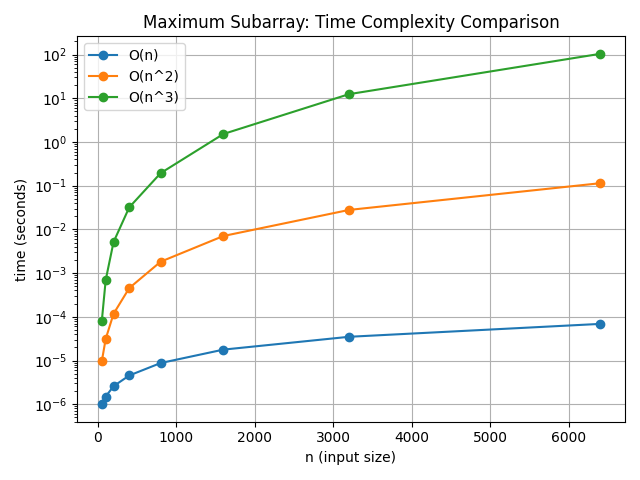

## 算法实现

根据 《算法竞赛入门经典》 第八章，实现并对比了四种经典解法：

| 算法 | 时间复杂度 | 思路 |
|----|----|----|
| 三重循环 | O(n³) | 枚举起点、终点并逐项求和 |
| 前缀和 | O(n²) | 子数组和 = 前缀和之差 |
| 线性扫描（Kadane） | O(n) | 维护最小前缀和 |
| 分治法 | O(n log n) | 最大子段要么在左、右或跨中点 |

---

## 项目结构

```text
.
├── 8-1-1.cpp        # 算法 1: 三重循环
├── 8-1-2.cpp        # 算法 2: 前缀和
├── 8-1-3.cpp        # 算法 3: 线性扫描
├── 8-1-4.cpp        # 算法 4: 分治法
├── bench.cpp        # benchmark 程序
├── run.sh           # 实验脚本，生成 csv 数据
├── plot.py          # 使用 matplotlib 画图
├── on1.csv          # O(n) 实验结果
├── on2.csv          # O(n^2) 实验结果
├── on3.csv          # O(n^3) 实验结果
└── README.md
```


## 可视化

对第 1, 2, 3 三种算法，绘制时间 ：输入规模 n 的折线图：



1. 编译 benchmark

```bash
g++ bench.cpp -O0 -std=c++17 -o bench
```

2. 运行实验

```bash
chmod +x run.sh
./run.sh
```

会生成：

```text
on1.csv
on2.csv
on3.csv
```

3. Python 环境准备（使用 venv）

```bash
python3 -m venv .venv
source .venv/bin/activate
pip install -r requirements.txt
```

4. 绘制结果

```bash
python plot.py
```

